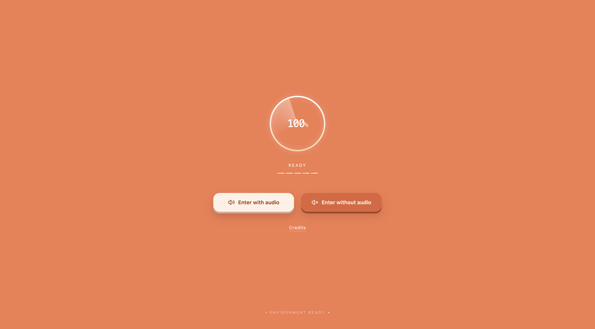
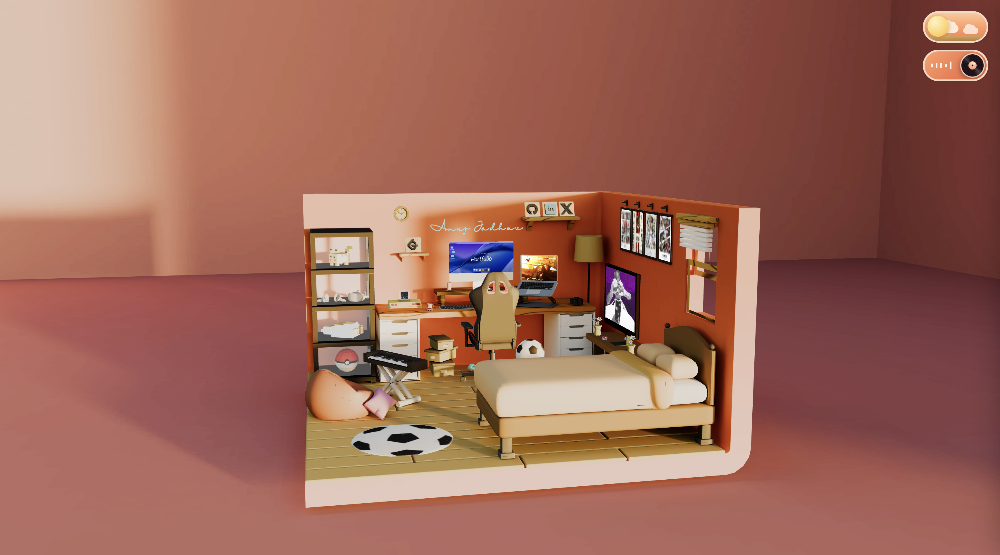
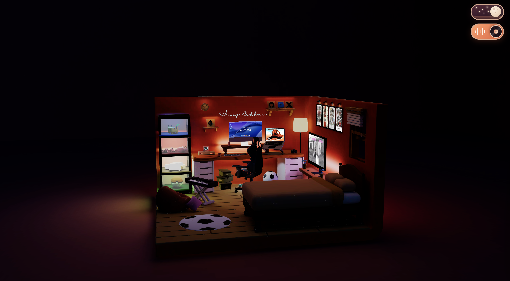

# 🏠 Anuj's Room Folio

An interactive 3D portfolio built as a cozy room you can explore in the browser. Powered by **React Three Fiber**, custom GLSL shaders, and Blender-baked lighting, with a day/night mode switch, a spiral shader transition, and dissolve/reveal animations.

**🔗 Live site:** [anuj-room-folio-amber.vercel.app](https://anuj-room-folio-amber.vercel.app/)

---

## 📸 Preview

### Loading Screen


### Day Mode


### Night Mode


---

## ✨ Features

- **3D room scene** – a fully explorable room with interactive objects (iMac, Mac, TV, poster, hologram).
- **Day / Night switching** – swaps between two Blender-baked texture sets for completely different lighting moods.
- **Spiral shader transition** – a custom full-screen spiral reveals the scene once loading is complete.
- **Dissolve / reveal animations** – objects appear using a custom `DissolveMaterial` built on top of `three-custom-shader-material`.
- **Custom loading screen** – tied to real asset progress and a minimum load timer, so the transition only fires when both are ready.
- **Baked lighting** – lighting and shadows are baked in Blender, so the scene stays fast and looks rich without real-time lights.
- **Camera controls** – tweakable through Leva during development.

---

## 🛠️ Tech Stack

| Area | Tools |
| --- | --- |
| Framework | React |
| 3D | Three.js, React Three Fiber, `@react-three/drei` |
| Shaders | GLSL, `three-custom-shader-material` (CSM) |
| Debug / Controls | Leva |
| Modeling & Baking | Blender |
| Hosting | Vercel |

---

## 🚀 Getting Started

### Prerequisites
- Node.js 18+
- npm, yarn, or pnpm

### Installation

```bash
# Clone the repository
git clone https://github.com/Anuj0720/anuj-room-folio.git
cd anuj-room-folio

# Install dependencies
npm install

# Start the dev server
npm run dev
```

Then open the local URL printed in your terminal (usually `http://localhost:5173`).

### Build for production

```bash
npm run build
npm run preview
```

---